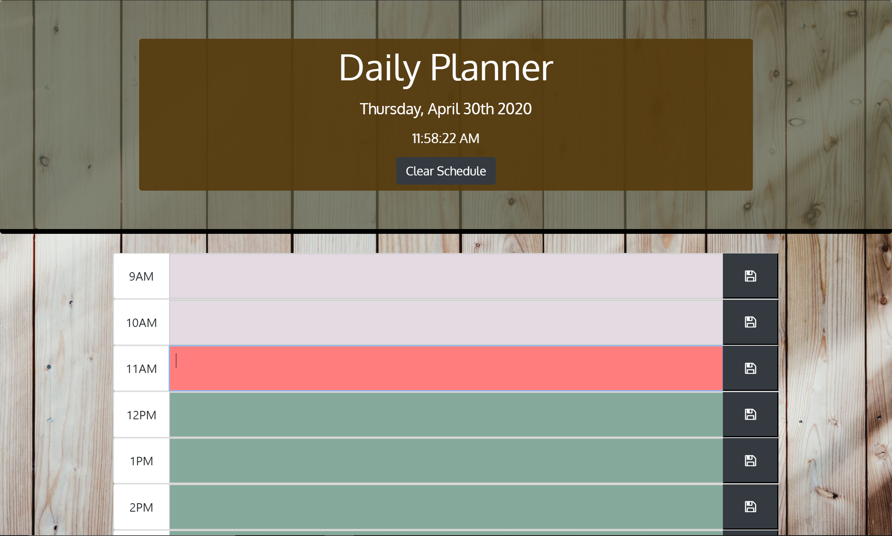
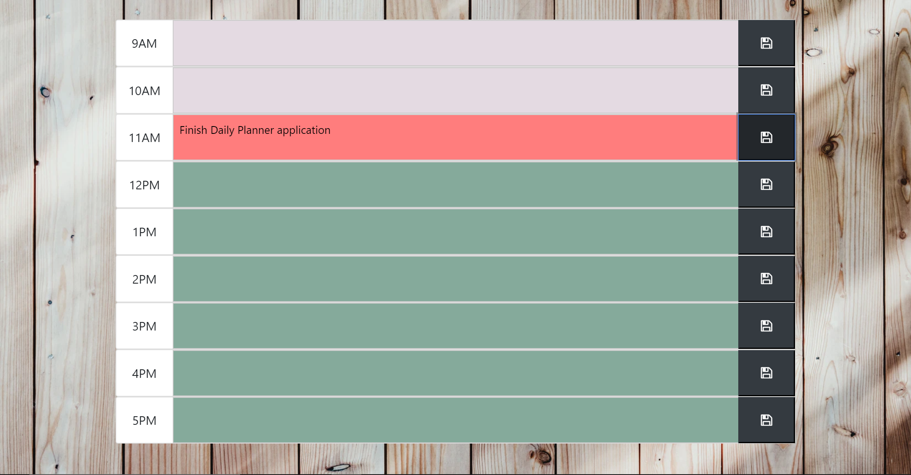

# Daily Planner

## URL

### https://gheptig.github.io/day-planner/

## Brief Description
This is a basic day calander/agenda planner for the standard American 9AM-5PM workday.  Using Moment.js and jQuery the current date and time is dynamically displayed at the top of the page.  The user is then able to input appointments/tasks for each individual hour and save their inputs using localstorage.  The input fields will also depending on the hour of the day change background colors to specify if the user's inputs are in the past, present, or future (see color key below).  Additionally  there is also a "Clear Schedule" button that will clear the users localstorage.  This gives the user the option to clear/restart their day if they choose to do so.

### Color-Key

* Gray Input Box = User's input is in the past.
* Red Input Box = User's input is in the present (current hour of workday).
* Green Input Box = User's input is in the future.

## Technologies Used

* [HMTL](https://developer.mozilla.org/en-US/docs/Web/HTML) - Gives application it's structure and DOM elements.

* [CSS](https://developer.mozilla.org/en-US/docs/Web/CSS) - Used to style the html elements/application.

* [Bootstrap](https://getbootstrap.com/docs/4.4/getting-started/introduction/) - Grid/Column system used to create page layout/structure.  Also used to create ansd style elements such as buttons.

* [JavaScript](https://developer.mozilla.org/en-US/docs/Web/JavaScript) - Used to dynamically display elements on html and get application to function/operate.

* [jQuery](https://jquery.com/) -  Used to simplify DOM traversal, event handling, and access to localstorge in written JavaScript.

* [Moment.js](https://momentjs.com/) - Gives access to the current date and time that in turn provides functionality to the application.

## Preview

## Contributers/Authors

* Augustus Heptig - Author/Creator

    * Body background image for application was found on https://unsplash.com/ *The internet’s source of freely usable images*.

